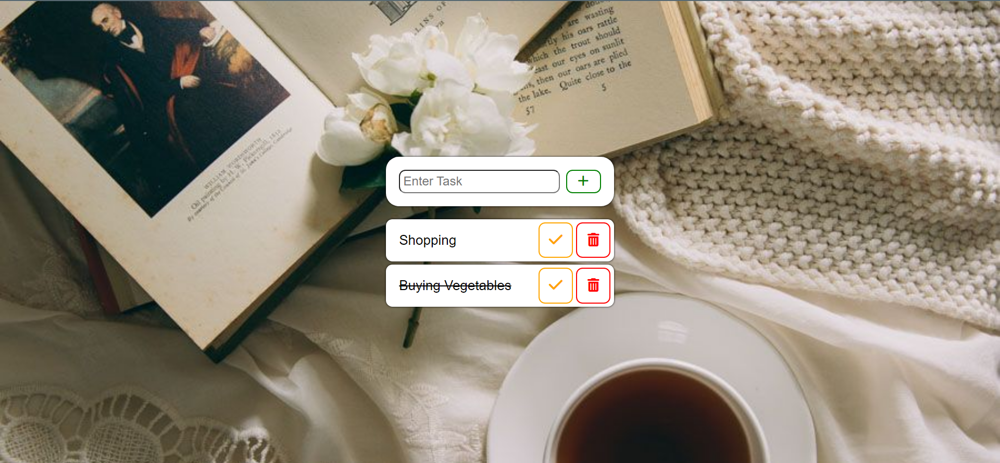

# To-do List

## Project Status

<h3> completed</h3>

### The challenge

Users should be able to:

- Add the work in the to-do list 
- They can mark it as done and can also delete the work.

### Built with

- Semantic HTML5 markup
- CSS
- Javascript

### Links

- Repository URL: [Repositiory Link](https://github.com/svandu/to-do-list)
- Live Site URL: [Live site Link](https://to-do-list-surbhi.netlify.app/)
